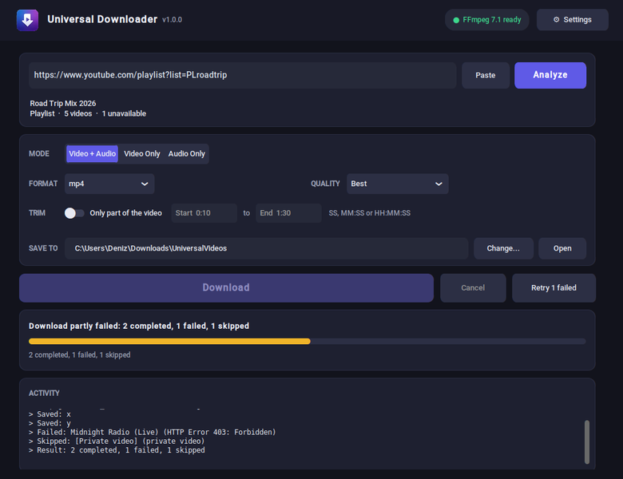
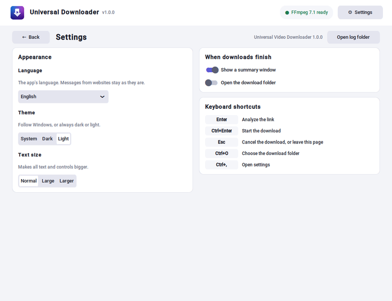

# Universal Video Downloader

A Windows desktop app for downloading video and audio from YouTube, TikTok,
Instagram, X and the other sites [yt-dlp](https://github.com/yt-dlp/yt-dlp)
supports. It is built with Python and CustomTkinter, and uses FFmpeg to merge,
convert and trim.

[Türkçe](README.tr.md)



## Install

Download **UniversalDownloader-Setup-&lt;version&gt;.exe** from the
[latest release](https://github.com/DorDeorz/UniversalDownloader/releases/latest)
and run it. The installer includes everything the app needs: the app itself,
FFmpeg and ffprobe, and Deno (which yt-dlp uses for YouTube). It installs for
the current user with no administrator prompt and adds a Start menu entry.
Windows 10 or 11 (64-bit) is required.

The installer is not code-signed, so Windows SmartScreen may show "Windows
protected your PC". Click **More info**, then **Run anyway**.

## What it does

- **Paste a link and analyze it.** The app shows what the link contains: a
  video with its length, or a playlist with how many entries can be
  downloaded. Private, deleted, members-only and live entries are listed
  with the reason they are skipped.
- **Choose what to save.**
  - Video + Audio, Video Only or Audio Only.
  - A video container (mp4, mkv or webm) or an audio format (mp3, m4a,
    opus, flac or wav).
  - A quality cap (4K down to 360p) or an audio bitrate.
  - Only part of the video (for example 0:10 to 1:30).
- **See each result.** Each item ends as completed, failed, skipped or
  cancelled, with the reason when it did not complete. Failed items can be
  retried with one click, and a running download can be cancelled without
  leaving partial files behind.
- **Files never overwrite each other.** A second "Title.mp4" becomes
  "Title (2).mp4". Playlists go into their own folder with numbered names.
- **Settings.** The settings open inside the window:
  - 25 languages.
  - Dark, light or the system theme.
  - Three text sizes.
  - What happens when downloads finish.
  - Keyboard shortcuts: Enter analyzes, Ctrl+Enter downloads, Esc cancels.
  - Choices are remembered between runs.



## Where it started and what it is now

The project started as a working prototype of about 400 lines of code in
four files: `main.py`, `ui.py`, `logic.py` and `utils.py`. A review of that
code, recorded in [ISSUES.md](ISSUES.md), found 90 problems. The main ones:

- **Broken features.** Trimming crashed. Video Only still kept the audio.
  Audio Only offered video containers such as mp4 as audio formats.
- **Security and silent failures.** HTTPS certificate checks were turned
  off, and errors were silenced. Every job ended with "Finished!", even when
  nothing had been downloaded.
- **Threading.** Worker threads updated the window directly, which could
  freeze or crash it. Two downloads could run at once against the same
  state.
- **Files.** Files with the same title overwrote each other.
- **Setup and build.** A plain clone started without FFmpeg, because the
  binaries were Git LFS pointers, and failed on the first download. There
  were no tests, dependencies were not pinned and the build was not
  reproducible.
- **Window.** The window had a fixed size and forgot every choice.

The fixes kept the original structure: `ui.py` for the window and
`logic.py` for yt-dlp. The logic that grew around them moved into small
modules, each documented in [`docs/`](docs):

| Area | Now |
|---|---|
| Correctness | Each mode produces what it says: real audio codecs, a hard quality cap, the chosen container, re-encoding when a codec does not fit. Trimming works, including in the packaged app. |
| Safety | HTTPS verification on, errors shown in plain words, network timeouts and bounded retries, links checked before any request. |
| Reliability | One job at a time; worker threads talk to the window through an event queue; cancel and close are clean; a second copy of the app does not start. |
| Files | Unique names, safe lengths under Windows' path limit, playlist folders, write and disk-space checks before a download. |
| Window | A resizable, redesigned window that fits the screen (and the taskbar) at every text size; settings inside the window that fit on one screen; WCAG AA text contrast in both themes. |
| Languages | 25 languages, switched live, with English as the fallback (`locales/`). |
| Tests | More than 340 tests run on Windows and Linux in CI, including real yt-dlp and FFmpeg downloads against a local server (no internet needed). |
| Build | Pinned dependencies, one PyInstaller spec, a preflight that refuses a broken build, checksums and build info, and a Windows installer built and tested by GitHub Actions. |

A few items from ISSUES.md are still open because they need a decision or an
outside resource: code signing, proxy settings and saving a playlist
selection. The
[pull request](https://github.com/DorDeorz/UniversalDownloader/pull/5) lists
them.

## Run from source

Python 3.11 or newer.

```
python -m venv .venv
.venv\Scripts\activate
python -m pip install -r requirements-dev.txt
git lfs pull            # the real bin\ffmpeg.exe and bin\ffprobe.exe
python main.py
```

Run the checks with `python -m ruff check .` and `python -m pytest`. See
[DEVELOPMENT.md](DEVELOPMENT.md).

## Build

- `python build_app.py` builds one portable EXE.
- `python build_app.py --onedir` builds a folder, which
  `installer\UniversalDownloader.iss` (Inno Setup 6) turns into the setup EXE.
- The **Release** workflow does both on GitHub. It installs the result on a
  Windows runner, starts the app, uninstalls it, and then publishes the
  release.

See [docs/building.md](docs/building.md).

## License notes

The app bundles third-party software under its own licenses, including
FFmpeg. See [THIRD_PARTY_NOTICES.md](THIRD_PARTY_NOTICES.md).
