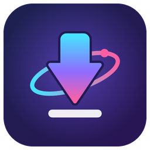
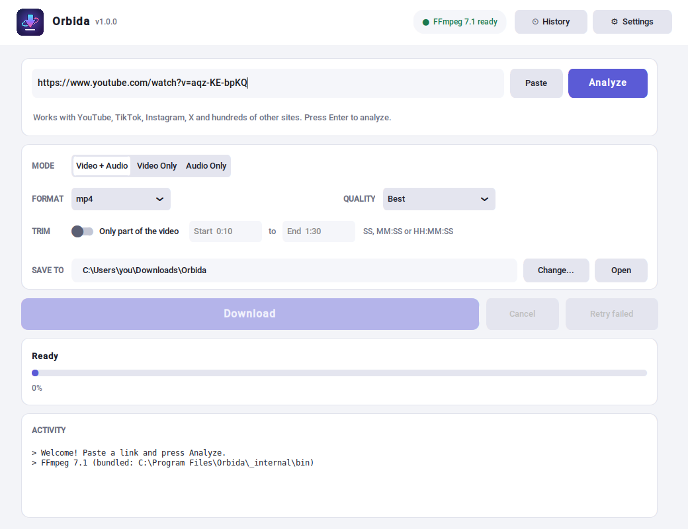
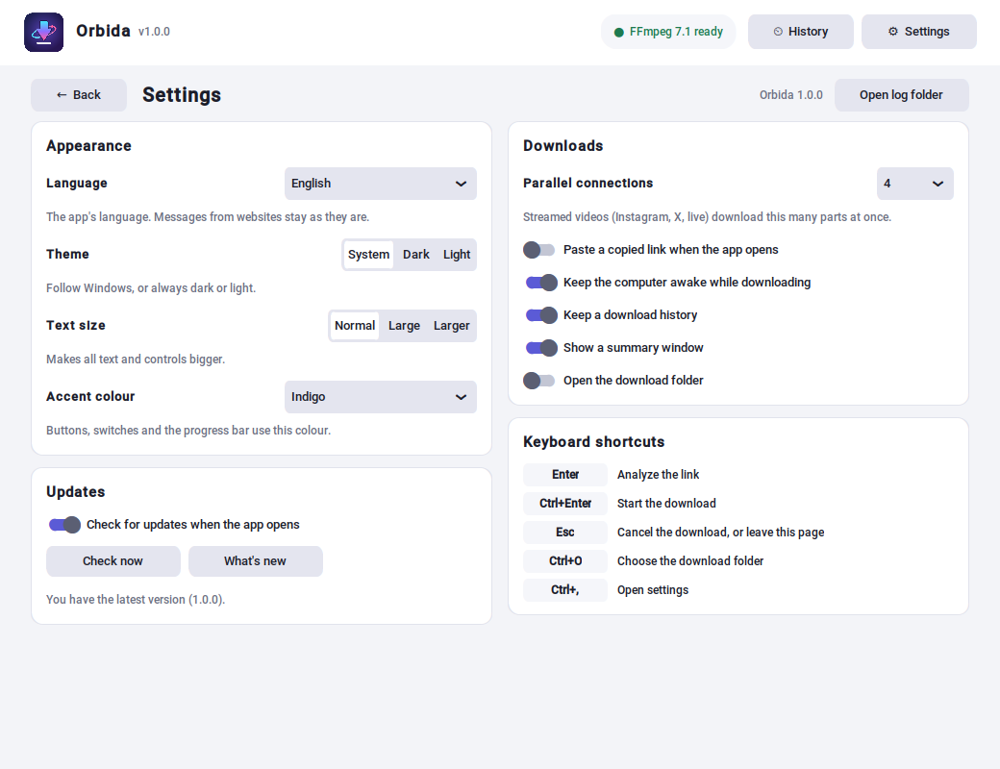
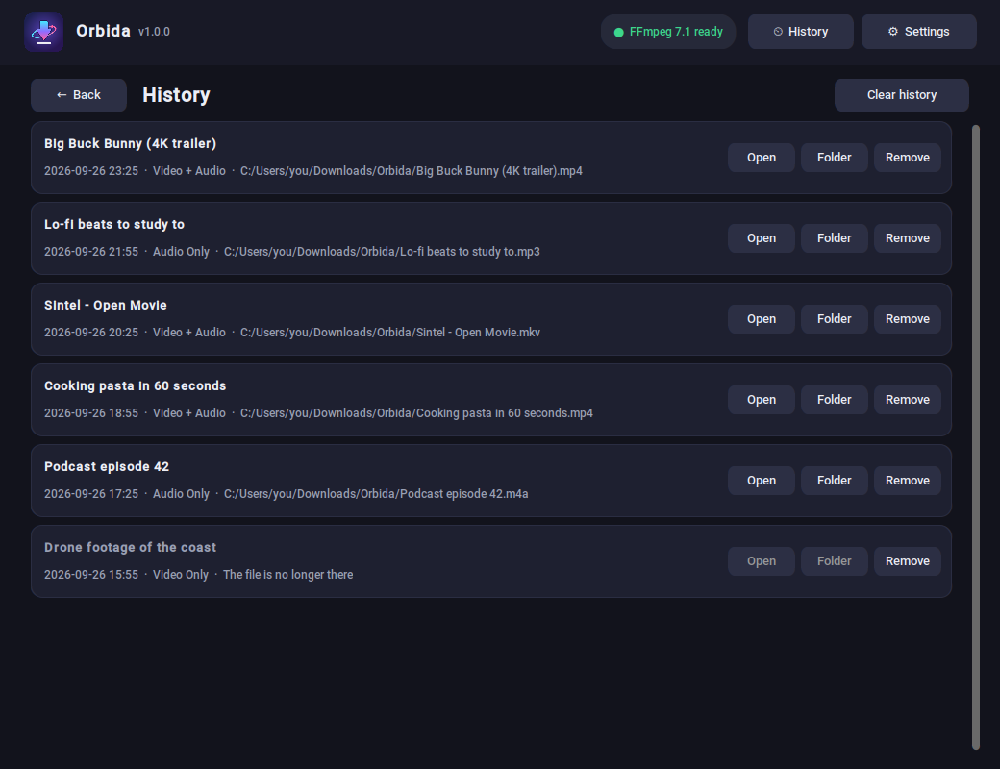

<p align="center"></p>

# Orbida

Orbida downloads video and audio from YouTube, TikTok, Instagram, X and the
other sites [yt-dlp](https://github.com/yt-dlp/yt-dlp) supports. There are
two apps:

- **Windows**, built with Python and CustomTkinter.
- **Android**, built with Kivy and KivyMD.

Both run the same download code and use FFmpeg to merge, convert and trim.
Orbida was called **Universal Video Downloader** up to version 1.0.2.

[Türkçe](README.tr.md)



## Download

Each version is one
[GitHub release](https://github.com/DorDeorz/UniversalDownloader/releases/latest)
that holds both apps.

| | File | Needs |
|---|---|---|
| Windows | `Orbida-Setup-<version>.exe` | Windows 10 or 11, 64-bit |
| Android | `Orbida-<version>.apk` | Android 7 or newer, 64-bit ARM phone |

`SHA256SUMS.txt` in the same release lists the checksums of both files.

**Windows.** Run the setup. It installs for your user only, with no
administrator prompt, and adds a Start menu entry. Everything the app needs
is included: FFmpeg, ffprobe, and Deno (which yt-dlp uses for YouTube). The
installer is not code-signed, so SmartScreen may say "Windows protected your
PC". Click **More info**, then **Run anyway**. If Universal Video Downloader
1.0.x is installed, the setup upgrades it in place and keeps your settings.

**Android.** Open the APK on the phone. Android asks you to allow "Install
unknown apps" for your browser or file manager. Allow it, go back and tap
**Install**. The app is not on Google Play, so Play Protect may scan it or
warn about an unknown developer: choose **More details**, then **Install
anyway**. If you had an Android preview (0.x), uninstall it once first:
1.0 has a new app id and its own signing key.

### Updates

Both apps check for a new version when they open and install it for you.
You do not need to uninstall first.

- **Windows.** An **Update to x.y.z** button appears in the top bar. It
  downloads the new setup, checks it against `SHA256SUMS.txt`, installs it
  and restarts Orbida.
- **Android.** Android asks you to confirm the update. It only installs an
  update signed with the same key as the installed app.

On Windows, see [docs/updates.md](docs/updates.md) for the details.

## Features

### Both apps

- **Paste or share a link, then Analyze.** A video shows its length. A
  playlist shows how many entries can be downloaded. Private, deleted,
  members-only and live entries are listed with the reason they are
  skipped.
- **Choose what to save.** Video with audio, or audio only. A quality cap
  (4K down to 360p) or an audio bitrate. MP4 or MKV for video. MP3, M4A,
  FLAC or WAV for audio.
- **Trim.** Download only part of a video, for example 0:10 to 1:30. The
  times are checked before the download starts.
- **Faster downloads.** Streamed videos (Instagram, X, live) download several
  parts at once. You can set how many under **Parallel connections**.
- **TikTok** works: yt-dlp sends browser-like requests (curl_cffi).
- **Every item gets a result.** Each one ends as completed, failed, skipped
  or cancelled, and says why when it did not complete. Cancelling leaves no
  partial files behind.
- **Files never overwrite each other.** A second "Title.mp4" becomes
  "Title (2).mp4".
- **History** of finished downloads, with Open and Remove.
- **Settings.** Theme and accent colour, language, parallel connections,
  pasting a copied link when the app opens, and keeping the device awake
  while downloading. Your choices are remembered.
- **Built-in updates** from GitHub releases.
- **Safe.** HTTPS certificates are always verified. Errors are shown in
  plain words, never hidden.

### Windows

- Video Only mode, and the WebM and Opus formats.
- Playlists open a selection dialog. The chosen entries go into their own
  folder with numbered names. Failed items can be retried with one click.
- 25 interface languages, switched without a restart. Three text sizes.
  Dark, light or system theme, and eight accent colours.
- The window fits the screen and stays above the taskbar at every text
  size. Settings open inside the window and never need scrolling.
- The History page has Open, Show in folder and Remove.
- Keyboard shortcuts: Enter analyzes, Ctrl+Enter downloads, Esc cancels,
  Ctrl+O picks the folder, Ctrl+, opens Settings.
- The computer does not go to sleep while a download runs.
- Only one copy of the app runs at a time. Closing during a download asks
  first and then stops cleanly.
- Downloads go to `Downloads\Orbida` by default.




### Android

- Material You design with Download, History and Settings tabs. On Android
  12 and newer, the colours follow your wallpaper.
- **Share** a link to Orbida from any app. Settings can make it analyze
  shared links right away.
- **YouTube without an account.** When YouTube asks you to "confirm you're
  not a bot", Orbida tries again through the phone's own browser engine.
  Signing in stays available but is optional.
- Files are saved to `Download/Orbida` and show up in gallery and music
  apps. History has Open, Share and Remove.
- The screen stays on while a download runs.
- English and Turkish.

Details: [android/README.md](android/README.md).

## What we built, step by step

The project started as a working Windows prototype: about 400 lines in four
files. Each step below was tested before it was released.

1. **Review.** [ISSUES.md](ISSUES.md) lists 90 problems found in the
   prototype:
   - Trimming crashed. Video Only kept the audio. Audio Only offered video
     containers such as mp4.
   - HTTPS checks were off, and errors were silenced. Every job ended with
     "Finished!", even when nothing was downloaded.
   - Worker threads changed the window directly, which could freeze or
     crash it.
   - Files with the same name overwrote each other.
   - A fresh copy of the code started without FFmpeg.
   - There were no tests, and the build could not be reproduced.
2. **Core fixes** ([#5](https://github.com/DorDeorz/UniversalDownloader/pull/5)).
   The original structure stayed: `ui.py` for the window and `logic.py` for
   yt-dlp.
   - Each mode now produces what it says.
   - Trimming works, including in the packaged app.
   - One job runs at a time, and worker threads talk to the window through
     an event queue.
   - HTTPS verification is on. Network requests have timeouts and a limited
     number of retries.
   - File names are unique and fit Windows' path limit.
   - FFmpeg is detected, and a missing FFmpeg gets a clear error.
   - Dependencies are pinned, the build is reproducible, and more than 340
     tests run in CI on Windows and Linux.
3. **Redesign, languages and installer** (v1.0.0). A new window with
   in-app settings, 25 languages, and a Windows installer that GitHub
   Actions builds and tests.
4. **TikTok** (v1.0.1). curl_cffi is now bundled, so yt-dlp can make
   browser-like requests.
5. **Windows fix** (v1.0.2). The mode buttons no longer shrink at startup.
6. **Android app.** It shares the download code with the Windows app.
   FFmpeg and QuickJS are built for Android and bundled. Every change is
   tested on an Android emulator in CI.
7. **Android 0.2.** This round brought:
   - a Material You design;
   - settings;
   - TikTok, trimming and the Share menu;
   - history;
   - faster downloads.
8. **Android stability.** The app closed at the first tap on phones with
   Qualcomm Adreno graphics, such as many Xiaomi and Samsung phones. The
   touch effect that crashed their graphics driver is now off. Error
   reports can be copied from inside the app.
9. **YouTube on phones.** When YouTube asks to "confirm you're not a bot",
   Orbida tries again through the phone's browser engine. No account is
   needed.
10. **Speed and the name Orbida.** Lists and dialogs got lighter. The app got
    its new name and its orbit icon.
11. **Orbida 1.0.** Both apps now have the same name, icon and settings. On
    Windows, this release added:
    - the History page;
    - accent colours;
    - parallel connections;
    - auto-paste;
    - keeping the PC awake during downloads.

    Both apps update themselves. Android builds are signed with the
    project's own key, and one release holds both apps.

Still open: code signing for Windows (needs a certificate), proxy settings,
and remembering a playlist selection.

## Run from source (Windows)

Python 3.11 or newer.

```
python -m venv .venv
.venv\Scripts\activate
python -m pip install -r requirements-dev.txt
git lfs pull            # the real bin\ffmpeg.exe and bin\ffprobe.exe
python main.py
```

Run the checks with `python -m ruff check .` and `python -m pytest`. See
[DEVELOPMENT.md](DEVELOPMENT.md).

## Build and release

- `python build_app.py --onedir` builds the app folder.
  `installer\Orbida.iss` (Inno Setup 6) turns it into the setup EXE. See
  [docs/building.md](docs/building.md).
- The Android APK is built with buildozer. See
  [android/README.md](android/README.md).
- The **Release** workflow builds both apps and tests them. It installs the
  Windows app on a runner and updates it in place. It tests the Android app
  on an emulator. Then it publishes both files in one release, tagged
  `orbida-v<version>`.

## License notes

The apps bundle third-party software under its own licenses, including
FFmpeg. See [THIRD_PARTY_NOTICES.md](THIRD_PARTY_NOTICES.md).
